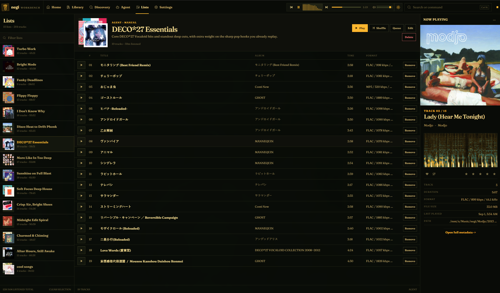
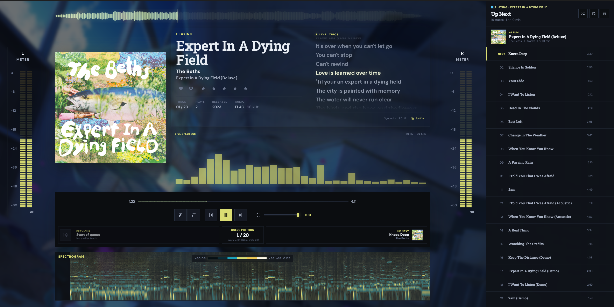
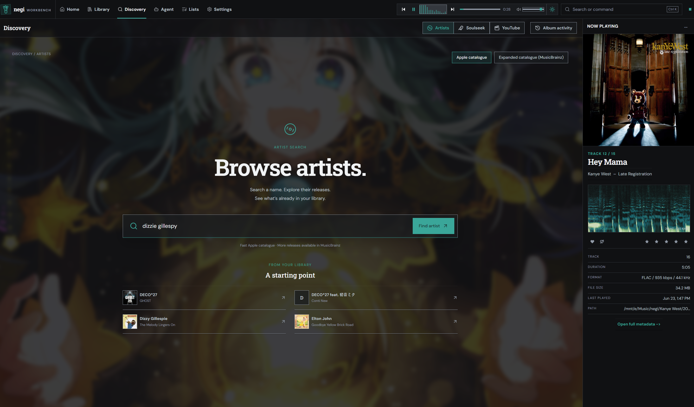
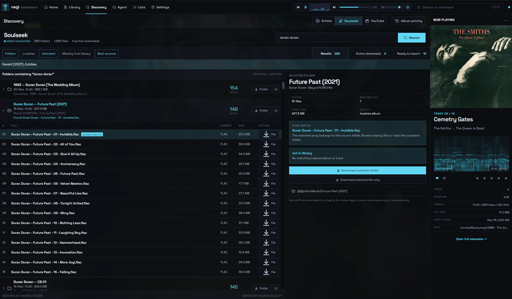
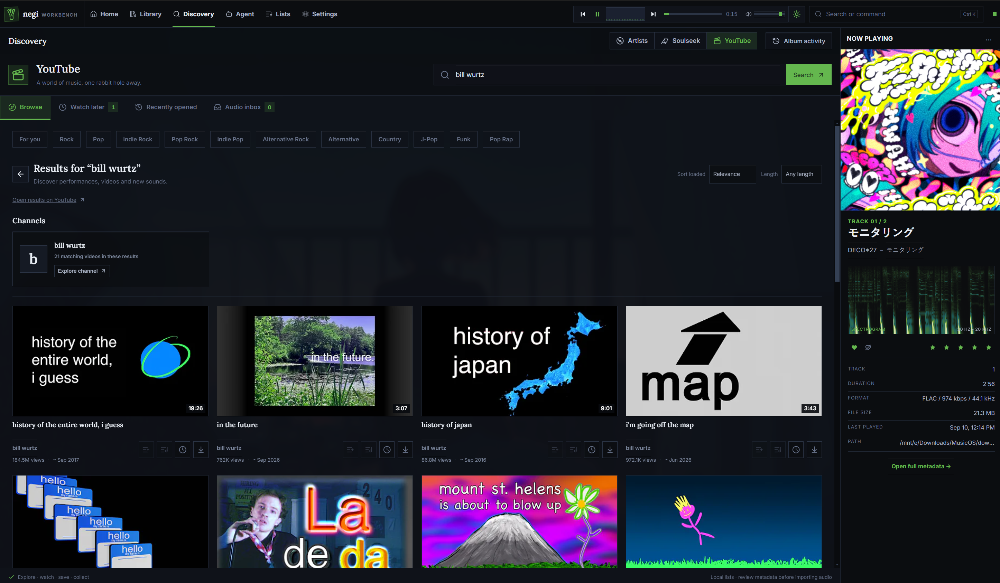
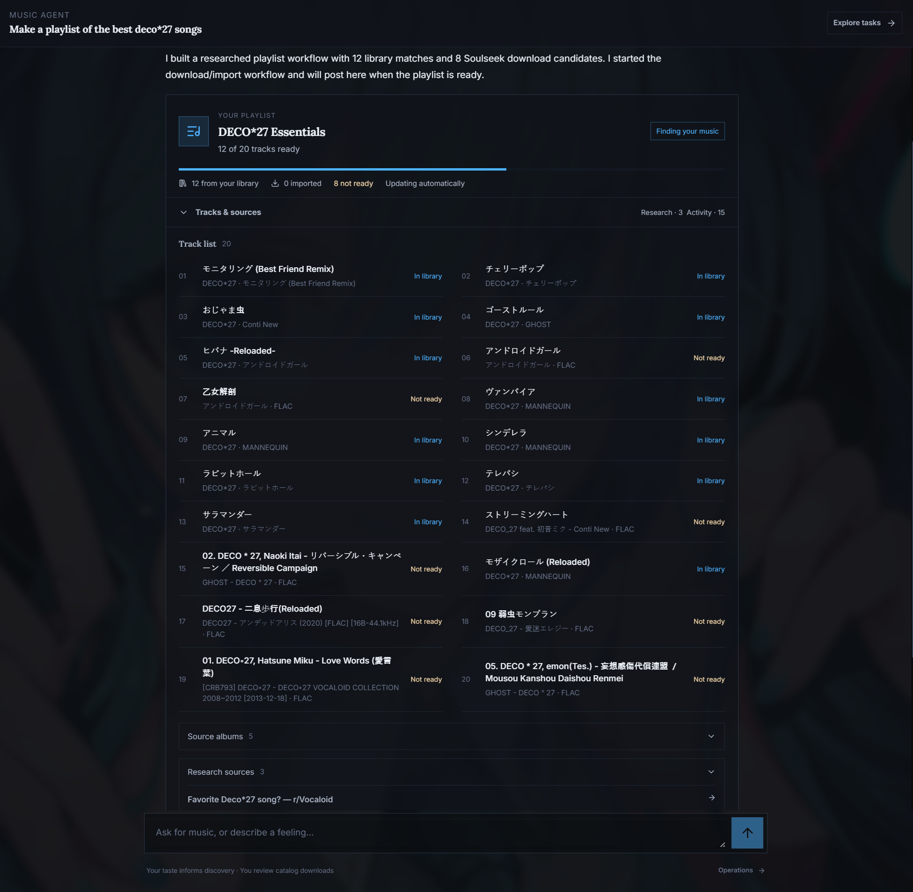

<div align="center">
  
  <h1>negi</h1>
  <p>A desktop music player for your local collection, music discovery, and playlists.</p>
  <p>
    <a href="#core-features">Features</a> ·
    <a href="#quickstart">Quickstart</a> ·
    <a href="#your-first-listen">Your first listen</a> ·
    <a href="#optional-integrations">Integrations</a> ·
    <a href="#development">Development</a>
  </p>
</div>

Browse your music by artist or album, follow a discography, and build a queue. negi keeps playback, listening history, catalogue discovery, and import review in the same app. Its optional agents use your collection and taste to find music and plan downloads or playlists.


negi is in active development. The setup below runs from source on Windows with Ubuntu WSL. After the first production build, you can launch the packaged app from Windows without keeping a WSL terminal open. slskd is still started separately when you want Soulseek.

## Core features

### Browse and manage your collection

Browse artists, albums, and tracks with artwork, ratings, favorites, play counts, and audio quality details. Artist pages include biographies, releases, and related artists when catalogue information is available.

Add music folders and scan their files into the library. Review metadata and destination paths before importing downloads. Find incomplete albums, inspect duplicate candidates and alternate editions, and track album acquisition and recovery.


https://github.com/user-attachments/assets/b784039d-d046-41c8-8662-81340aa0d966

### Play albums, queues, and playlists

Local playback uses mpv. Play an album in order, shuffle, repeat, or choose what comes next. Track menus let you play next, add to the end of the queue, or add songs to a playlist.

Reorder the queue and save upcoming tracks as a playlist. Edit playlist names, descriptions, and track order for your next session.

Open Lists to browse saved playlists, play or shuffle a selection, and edit its tracks.



### Open Now Playing

The expanded player combines track details, an Up Next queue, and an animated 3D record player. Choose a turntable layout and enable an optional record exchange when playback moves to another album.

Switch to lyrics to follow the current line or select a timestamped line to seek. Lyrics come from LRCLIB and stay cached locally. When only untimed lyrics are available, the app labels its scrolling as estimated.

FFmpeg adds waveforms and audio visualization. In Settings, choose which meters and visualizers appear and use colors from the album artwork, your theme, or a custom color.




### Discover artists and releases

Search for an artist or start with someone from your library. Choose the Apple catalogue for release browsing or MusicBrainz for an expanded release view.



Browse discographies and see which releases you already own. Artist connections explain recommendations through shared genres and listener relationships. Community album ratings can help you choose a starting point.


### Find music on Soulseek

Connect slskd to search Soulseek inside negi. Browse results by folder, compare audio formats and file sizes, and see whether a match is already in your library. Download a complete folder or a matched file, then follow its progress in Active downloads and Ready to import.

Manual downloads enter staging for metadata and destination review. Album acquisition can fill gaps in your collection, with progress, missing tracks, failures, and recovery options in Album activity.



### Browse and play YouTube

Browse a feed based on your taste, choose genre shortcuts, search, or open a channel or playlist. Save videos to Watch later and return to recently opened items. These lists stay in negi and do not sync with a YouTube account.

Play audio or video, use fullscreen, and build a video queue. Playback can continue in the background while you browse elsewhere. Starting library music pauses YouTube, and starting YouTube pauses library music. Downloads go through editable metadata review before import.



### Ask an agent to find music

Ask for a song, an album, an artist's discography, missing releases, related artists, or a playlist. Catalogue requests let you select the artist, scope, and releases before queueing downloads. Plans account for music you already own and your saved audio quality preferences.

Common catalogue requests work with the local planner. Optional OpenAI planning adds conversational research and playlist curation. Playlist results show available tracks and any gaps, with recovery for pending imports.

Try a request such as:

- `Find the song "Stand by Me" by Ben E. King`
- `Find missing albums by Portishead`
- `Recommend albums based on my taste`
- `Make a playlist for a rainy evening`



### See your listening history and taste

Home shows a top-25 album wall, daily listening activity, frequent artists, repeated tracks, and unplayed records. Listening insights break down genres, decades, and collection coverage.

negi learns preferences from listening, likes, and ratings without model calls. Settings shows the evidence and lets you save your own preferences. Explicit choices take priority over learned taste. Agents and YouTube recommendations use that profile, including blocked artists and genres where applicable.


### Choose the appearance

Set separate light and dark profiles with palettes, font pairings, accents, corner styles, and wallpapers. Adjust wallpaper strength, blur, and placement, then save named looks to reuse later.


## Quickstart

The current desktop workflow runs the backend and renderer in Ubuntu WSL and opens a native Windows Electron window. Local playback does not require an OpenAI key, a Soulseek account, or an Apple Music subscription.

### 1. Install the prerequisites

You need:

- Windows with Ubuntu WSL and Windows executable access from WSL.
- Git and Node.js 22 with npm inside Ubuntu WSL.
- Node.js with npm on Windows, for the Electron shell and playback IPC.
- A Windows mpv installation, with its `mpv.exe` path available.

Keep the checkout in the WSL Linux filesystem. Keep music on a Windows drive that both WSL and Windows mpv can access, such as `D:\Music`.

If npm needs to compile native dependencies, install the build tools in Ubuntu:

```bash
sudo apt update
sudo apt install -y build-essential python3
```

### 2. Clone and configure

Run in an Ubuntu WSL terminal:

```bash
git clone https://github.com/JamesAC42/negi.git
cd negi
npm ci
cp .env.example .env
```

Edit `.env` in the repository root. Replace the example executable paths with your actual locations:

```dotenv
MUSIC_OS_MPV_PATH="/mnt/c/Program Files/mpv/mpv.exe"
MUSIC_OS_WINDOWS_NODE_PATH="/mnt/c/Program Files/nodejs/node.exe"
```

The Windows Node path is needed if `node.exe` is not on the PATH inherited by WSL. Leave the default host and port for the managed launcher. Optional service credentials can wait until you enable those integrations.

### 3. Prepare the Windows Electron shell

The launcher expects `%LOCALAPPDATA%\negi-dev-shell`. It does not install this shell for you.

Run once in Windows PowerShell:

```powershell
$negiShell = Join-Path $env:LOCALAPPDATA "negi-dev-shell"
New-Item -ItemType Directory -Force -Path $negiShell | Out-Null
Set-Location $negiShell
npm init -y
npm install --save-dev electron@^31.7.0
New-Item -ItemType Directory -Force -Path app | Out-Null
if (-not (Test-Path app/package.json)) {
    '{"name":"negi-dev-shell","private":true,"type":"module","main":"dist/main/index.js"}' |
        Set-Content -Encoding ascii app/package.json
}
```

The managed launcher copies the app manifest and built Electron files into this shell. To use another location, export `MUSIC_OS_ELECTRON_SHELL` in your WSL terminal before launching.

### 4. Start negi

Back in the WSL checkout:

```bash
npm run dev:app
```

Wait for the desktop window to open. The command starts the backend and renderer, builds Electron, and launches the Windows shell. Keep this terminal open while using the app. Press Ctrl+C once to stop the managed processes.

`npm run dev` only starts the Vite renderer. Use `npm run dev:app` for the full desktop stack.

If startup fails, run this in another WSL terminal from the checkout:

```bash
npm run dev:doctor
```

It checks service health, process ownership, ports, and the copied Electron files. If an older manually started backend, renderer, or Electron window occupies the required ports or shell, close that instance before trying again.

### 5. Optional: launch a production build from Windows

From the WSL checkout, after the development setup above:

```bash
npm run build:app
```

This builds a minified renderer, copies it into `%LOCALAPPDATA%\negi`, and writes a Windows shortcut. Double-click `negi.lnk` or `Start negi.cmd` in that folder. The app starts the WSL backend without Vite or `tsx watch`, then opens the packaged Electron window. Close the window to stop the backend it started. slskd is not launched.

Rebuild with `npm run build:app` after source changes you want in that Windows launch. Do not mix this with a running `npm run dev:app` session if you want the production window to own the backend.

## Your first listen

1. Open Library, then Roots. Choose Browse or enter a folder such as `/mnt/d/Music` for `D:\Music`.
2. Select Add Root. negi scans the folder and indexes its music. Mark a folder with Watch to include it in Scan Watched, or use Rescan for one folder.
3. Open an artist or album and play a track. Use a track's menu to queue more music or add it to a playlist.
4. Open expanded Now Playing from the player artwork or expand control. Try the record layouts, lyrics, and queue. Use Save as playlist to keep upcoming tracks.
5. Open Settings to choose your appearance, adjust Now Playing, and review your taste profile. Home fills in as you listen.

Catalogue browsing and lyrics need an internet connection. Set up the integrations below when you want downloads, YouTube, visualizers, or hosted agent planning.

## Optional integrations

| Integration | What it adds | Setup |
| --- | --- | --- |
| Apple catalogue | Artist search, releases, and library ownership | Enabled by default, with no Apple API key. This does not include Apple Music subscription playback. |
| MusicBrainz | Expanded releases, artist metadata, and community ratings | Choose it in catalogue browsing. Enabled in `.env.example`; no database dump required. |
| LRCLIB | Synced or untimed lyrics, cached locally | Open Lyrics in Now Playing. No API key required. Availability varies by song. |
| FFmpeg | Waveforms and visualizer analysis; audio extraction for YouTube imports | Install it in WSL and set `MUSIC_OS_FFMPEG_PATH` if it is not detected. |
| YouTube / yt-dlp | Video browsing, audio/video playback, and import review | Install the tools below. Optional session cookies can be added in Settings under YouTube playback. |
| slskd / Soulseek | File search, downloads, and album acquisition | Run slskd separately. Set `MUSIC_OS_SLSKD_URL`, API key or login credentials, and `MUSIC_OS_SLSKD_DOWNLOAD_DIR` in `.env`. Both the service and completed files must be reachable from WSL. |
| OpenAI | Hosted agent planning, music research, and playlist curation | Set `MUSIC_OS_AGENT_MODEL_PROVIDER=openai` and `OPENAI_API_KEY`. Override `MUSIC_OS_OPENAI_MODEL` if needed. Hosted requests use your API account. |

For YouTube and FFmpeg, run in WSL from the checkout:

```bash
sudo apt install -y curl python3 ffmpeg
npm run setup:youtube
```

The setup script downloads and checks yt-dlp, then installs it under the repository's `.music-os/tools` directory. Node.js from the quickstart supplies its JavaScript runtime. Restart the managed stack after installing the tools or changing `.env`. Run `npm run setup:youtube` again to update yt-dlp.

For slskd on Windows, the example loopback URL assumes WSL mirrored networking. Otherwise, use a Windows host address that WSL can reach. YouTube cookies can help with permitted signed-in playback, but do not make every video available or sync account history and subscriptions.

See [`.env.example`](.env.example) for the full configuration. Keep credentials in your local `.env`.

## Development

negi uses Electron, React, TypeScript, SQLite, and mpv. Most interface code lives in `apps/desktop`, API and library services in `apps/backend`, and shared types in `packages/core`.

| Command | Purpose |
| --- | --- |
| `npm run dev:app` | Start the managed desktop stack |
| `npm run dev:doctor` | Check processes, service health, and Electron synchronization |
| `npm run dev:stop` | Stop the managed stack |
| `npm run dev:sync` | Rebuild and copy Electron main/preload without launching the app |
| `npm run build:app` | Build a production app you can launch from Windows |
| `npm run start:app` | Build the production app and launch it |
| `npm run typecheck` | Typecheck the workspaces |
| `npm run build` | Build the workspaces; this does not produce an installer |

Renderer changes reload through Vite. Backend changes restart the watched service. Electron main/preload changes trigger a rebuild, sync, and Electron restart.

<details>
<summary>Browser preview for renderer development</summary>

Run `npm run dev:backend` and `npm run dev` in separate WSL terminals, then open <http://127.0.0.1:5173>. Native file pickers and other Electron features require the desktop app. Stop these processes before switching to `npm run dev:app`.

</details>

Use the relevant workspace's scripts for focused smoke tests. Inspect live integration tests before running them, since some start playback, transfer files, or use paid APIs.

### Further reading

- [Development environment and repository guide](AGENTS.md)
- [Discovery and album acquisition](docs/discovery-expansion.md)
- [Artist profiles and connections](docs/artist-connections.md)
- [YouTube browsing and playback](docs/youtube-browsing.md)
- [Agents and playlist delivery](docs/agents.md)
- [Listening-derived taste](docs/taste-learning.md)
- [Home and listening insights](docs/home-redesign.md)
- [Record player](docs/record-player.md), [lyrics](docs/lyrics.md), and [Now Playing settings](docs/now-playing-settings.md)
- [Appearance settings](docs/appearance-studio.md)
