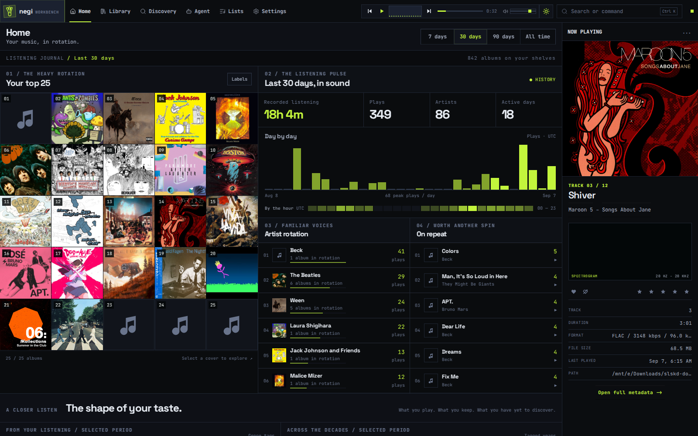
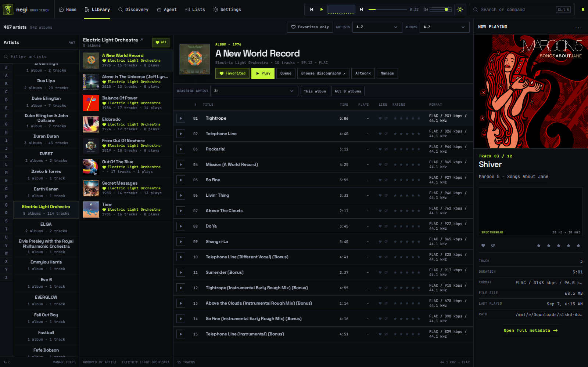
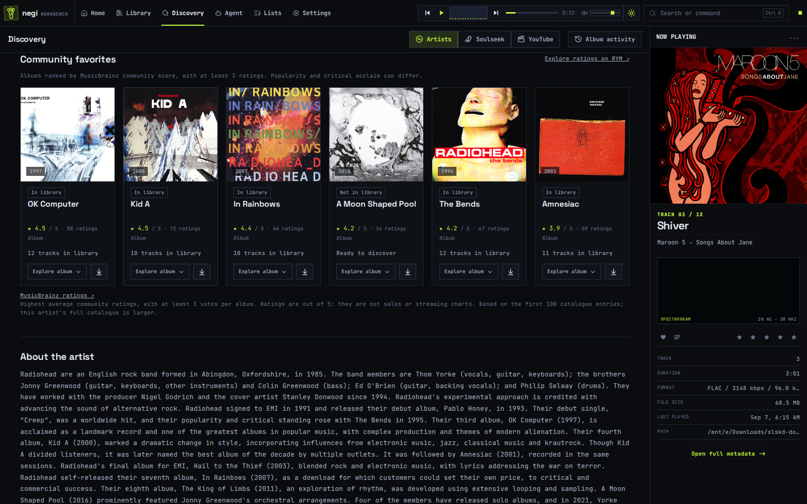
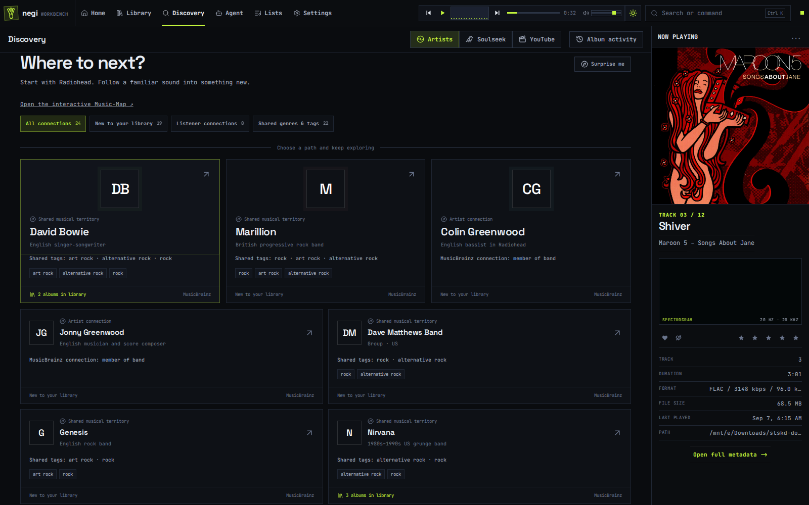
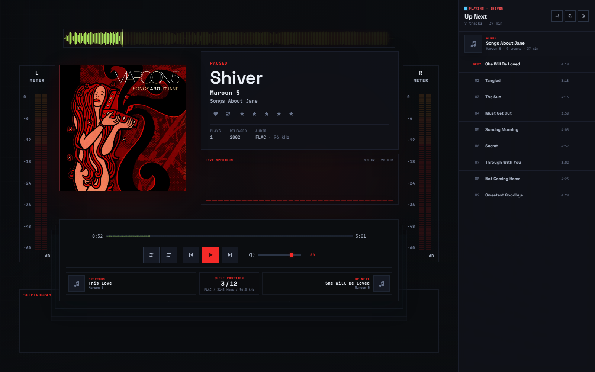
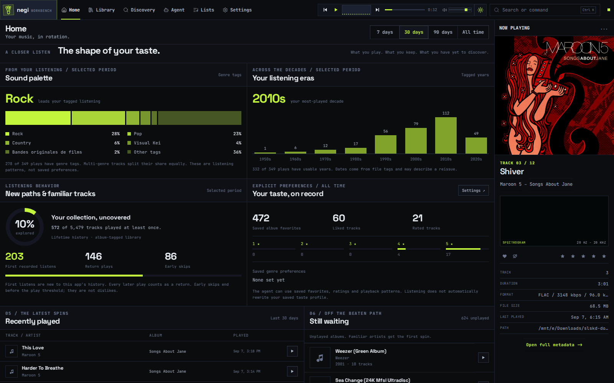
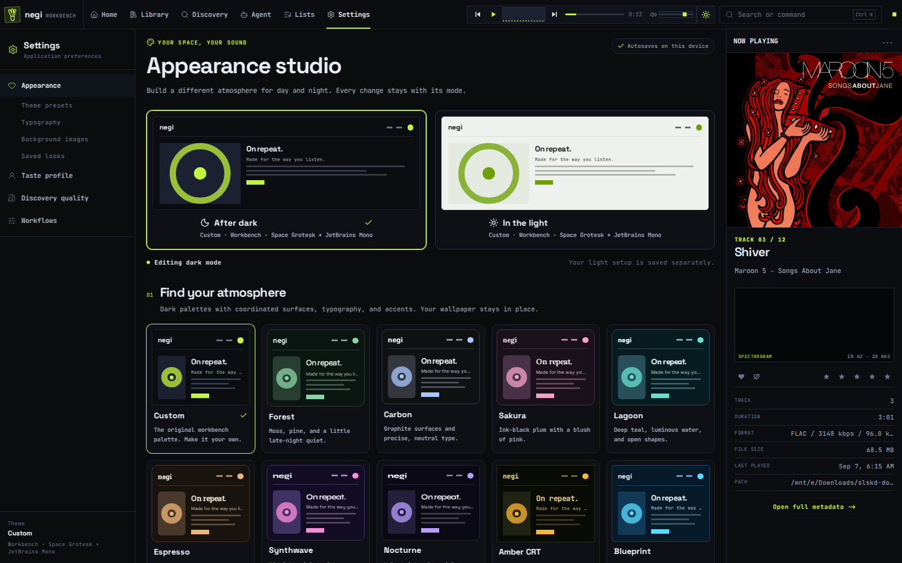

<div align="center">
  
  <h1>negi</h1>
  <p><strong>Your music. Your collection. Your next discovery.</strong></p>
  <p>A desktop music workbench for listening, collecting, and getting lost in a good discography.</p>
  <p>
    <a href="#a-look-around">Take a look</a> ·
    <a href="#run-it-locally">Run it locally</a> ·
    <a href="#optional-integrations">Integrations</a> ·
    <a href="#development">Development</a>
  </p>
</div>



negi brings your local music library, listening history, and catalogue discovery into one workspace. Browse the records you own, follow an artist into unfamiliar territory, and keep the details that matter close at hand.

Built with **Electron, React, TypeScript, SQLite, and mpv**. Currently a development project, with a managed **Windows + Ubuntu WSL** desktop workflow.

## A look around

### A library worth spending time in

Move from artist to album to track without losing your place. Keep favorites, ratings, play counts, and audio quality alongside the music. Queues and playlists give the next listening session somewhere to start.



### Follow your curiosity

Search the Apple catalogue, browse discographies, and see what is already in your collection. Expand into MusicBrainz when you want another view of an artist's releases. Artist pages bring together biographies, community-rated albums, and musical connections.



<details>
<summary><strong>See artist connections</strong> — take the long way to your next favorite</summary>

Follow listener connections and shared genres, see why an artist was suggested, and retrace your route through artist breadcrumbs.



</details>

### Make room for the song

Expanded Now Playing puts the artwork, queue, waveform, and playback controls in one focused view. Song details include play count, release year, and format when available. Optional FFmpeg analysis adds waveforms and visualization.



### Get to know your listening

Home is a listening journal: a top-25 cover wall, daily activity, familiar artists, repeat tracks, and records still waiting for their first spin. Look closer to explore genres, decades, collection coverage, and the preferences you have saved.



### Set your own atmosphere

Choose from curated palettes and font pairings, adjust accents and corners, and add a wallpaper. Light and dark modes keep separate profiles; named looks let you save more than one favorite.



### Keep the collection moving

- **Review imports:** inspect metadata and destinations before bringing new files into the library.
- **Fill the gaps:** identify incomplete albums and follow album acquisition and recovery activity.
- **Explore more sources:** optional Soulseek and YouTube workflows connect discovery with import review.
- **Plan with an agent:** use library context and saved preferences for music requests, with optional OpenAI planning and visible operation workflows.

<sub>Screenshots show the current app with a local music collection. Artwork and catalogue information belong to their respective owners and sources.</sub>

## Run it locally

The managed desktop workflow runs the backend and renderer in **Ubuntu WSL**, then launches **native Windows Electron**. Have Git, Node.js/npm in WSL, Windows Node.js, and Windows mpv installed. Node.js 22 is used in the current development environment.

### 1. Prepare the checkout

Run in WSL:

```bash
git clone https://github.com/JamesAC42/negi.git
cd negi
npm ci
cp .env.example .env
```

Edit `.env` for your machine. In particular, set `MUSIC_OS_MPV_PATH` to the WSL-readable path of your Windows mpv executable. Set `MUSIC_OS_WINDOWS_NODE_PATH` if Windows Node is not available through WSL's inherited PATH. The example paths are machine-specific.

### 2. Prepare the Windows Electron shell

The launcher expects a separate shell at `%LOCALAPPDATA%\negi-dev-shell`; it does not install this shell automatically.

<details>
<summary>First-time shell setup in Windows PowerShell</summary>

These commands create the shell and its initial app manifest. The managed launcher replaces that manifest and synchronizes the built main/preload bundles from your WSL checkout.

```powershell
$negiShell = Join-Path $env:LOCALAPPDATA "negi-dev-shell"
New-Item -ItemType Directory -Force -Path $negiShell | Out-Null
Set-Location $negiShell
npm init -y
npm install --save-dev electron@^31.7.0
New-Item -ItemType Directory -Force -Path app | Out-Null
if (-not (Test-Path app/package.json)) {
    '{"name":"negi-dev-shell","private":true,"type":"module","main":"dist/main/index.js"}' |
        Set-Content -Encoding ascii app/package.json
}
```

Use `MUSIC_OS_ELECTRON_SHELL` to point the launcher at a different shell location.

</details>

### 3. Start the app

Back in the WSL checkout:

```bash
npm run dev:app
```

This starts the backend and Vite, builds and synchronizes Electron, and launches the desktop window. Main/preload edits trigger a shell rebuild and restart. Press **Ctrl+C once** to stop the managed stack.

Open **Library** to add your music folders. WSL paths such as `/mnt/d/Music` let the backend reach Windows drives.

<details>
<summary>Browser-only development preview</summary>

To work on the renderer without launching Electron, run these in separate WSL terminals:

```bash
npm run dev:backend
```

```bash
npm run dev
```

Open **http://127.0.0.1:5173**. Native desktop features, including wallpaper file selection, need Electron. Stop these standalone processes before switching to `npm run dev:app`.

</details>

## Optional integrations

Start with your local collection and enable the services you use.

| Integration | What it adds | Configuration |
| --- | --- | --- |
| Apple catalogue | Fast artist and release browsing, with library ownership | Default catalogue; no Apple API key required. Catalogue browsing does not provide Apple Music subscription playback. |
| MusicBrainz | Expanded releases, artist metadata, and community ratings | Explicit catalogue option; no local database dump required. |
| slskd / Soulseek | Search, downloads, and album acquisition | Set the URL, credentials, and completed-download folder in `.env`. |
| YouTube / yt-dlp | Video discovery and audio import review | Run `npm run setup:youtube`; requires curl and Python 3 for setup, plus FFmpeg and Node for the workflow. Restart the backend afterward. |
| FFmpeg | Waveform generation and visualizer analysis | Set `MUSIC_OS_FFMPEG_PATH`. |
| OpenAI | Hosted planning for the music agent | Set `MUSIC_OS_AGENT_MODEL_PROVIDER=openai`, `OPENAI_API_KEY`, and optionally `MUSIC_OS_OPENAI_MODEL`. |

See [the example configuration](.env.example) for additional settings. Keep credentials in your local `.env`.

## Development

| Command | Purpose |
| --- | --- |
| `npm run dev:app` | Start the managed desktop stack |
| `npm run dev:doctor` | Check processes, service health, and Electron bundle synchronization |
| `npm run dev:stop` | Stop the managed stack |
| `npm run dev:sync` | Rebuild and synchronize main/preload without launching the app |
| `npm run typecheck` | Typecheck the workspaces |
| `npm run build` | Run the available workspace builds |

The main code lives in `apps/desktop` (Electron and React), `apps/backend` (API, library, discovery, and playback), and `packages/core` (shared types and schemas). Supporting packages live alongside core.

For focused smoke tests, use the relevant workspace's package scripts. Some live integration tests can start playback, perform transfers, or use paid APIs; inspect the script before running it.

### Further reading

- [Development environment and repository guide](AGENTS.md)
- [Discovery and album acquisition](docs/discovery-expansion.md)
- [Artist profiles and connections](docs/artist-connections.md)
- [Home and listening insights](docs/home-redesign.md)
- [Appearance studio](docs/appearance-studio.md)
